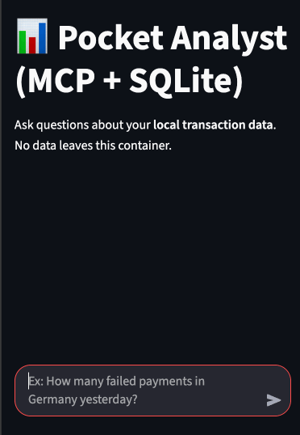

# MCP Local Analyst


Talk to your data locally 💬📊. A private AI Data Analyst built with the Model Context Protocol (MCP), Ollama, and SQLite. Turn natural language into SQL queries without data leaving your machine. Includes a Dockerized Streamlit UI

## Getting Started

### Prerequisites

Before running the application, make sure you have the following installed:

1. **Docker & Docker Compose** - Required for running the application in containers
   - Install Docker Desktop from [docker.com](https://www.docker.com/products/docker-desktop)
   - Includes Docker Compose by default

2. **Ollama** - For running local LLM models
   - Download from [ollama.ai](https://ollama.ai)
   - After installation, pull a model: `ollama pull mistral` (or your preferred model)
   - Ollama will run as a service on `http://localhost:11434`

### Installation & Running Locally

1. Clone the repository:
   ```bash
   git clone <repository-url>
   cd mcp-local-analyst
   ```

2. Ensure Ollama is running:
   ```bash
   ollama serve
   ```
   (Keep this running in a separate terminal)

3. Start the application with Docker Compose:
   ```bash
   docker-compose up --build
   ```

4. Open your browser and navigate to:
   ```
   http://localhost:8501
   ```

### Configuration

- Modify the database by editing `src/seed_data.py` if needed
- Configure model selection and parameters in the application UI
- Data is stored in the `data/` directory

